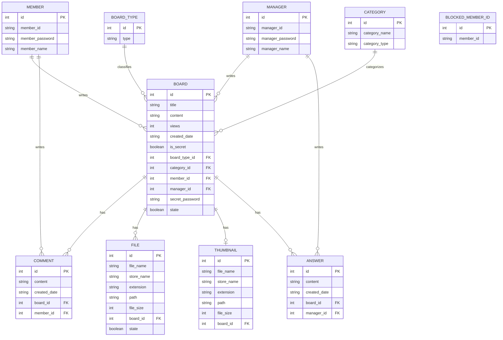

# 커뮤니티형 게시판 SPA 포트폴리오

## 1. 프로젝트 한 줄 요약

게시판별 정책을 Strategy 패턴으로 분리해 확장성을 높이고, JWT 기반 인증·인가, 파일 업로드 보안, 비밀글 접근 제어를 구현한 Vue/Spring Boot 기반 커뮤니티형 SPA 프로젝트입니다.

## 2. 프로젝트 개요

| 항목 | 내용 |
|---|---|
| 프로젝트명 | 커뮤니티형 게시판 SPA |
| 개발 기간 | 약 1달 반 |
| 개발 형태 | 개인 프로젝트 |
| 담당 역할 | Backend, Frontend 전체 구현 |
| 주요 기능 | 게시판 CRUD, 인증/인가, 파일 업로드, 댓글, 갤러리, 비밀 문의글 |
| Backend | Spring Boot, MyBatis, MySQL |
| Frontend | Vue 3, Pinia, Vue Router |
| 테스트 | JUnit 5, Mockito, Testcontainers |
| API 문서 | Springdoc OpenAPI / Swagger UI |

## 3. 핵심 문제해결 경험

### 3-1. 50만 건 데이터 환경에서 게시글 목록 조회 성능 개선

#### 문제 상황

프로젝트 완성 후 실제 운영 상황에 가까운 부하를 확인하기 위해 게시글 데이터를 50만 건까지 늘려 k6 부하 테스트를 진행했습니다. 테스트 데이터는 자유게시판 80%, 갤러리 16%, 문의게시판 4%를 기준으로 하고, 공지사항은 별도 소량 데이터를 추가하는 방식으로 직접 SQL 반복문을 통해 생성했습니다.

기존 데이터가 약 700건 수준일 때는 성능 문제가 드러나지 않았지만, 50만 건 환경에서 게시판 목록 조회 API인 `/api/{boardType}`의 평균 응답 시간이 약 30초까지 증가했고, p95는 60초까지 상승했습니다.

#### 원인 분석

게시판 목록 조회는 내부적으로 두 개의 쿼리가 순차 실행되는 구조였습니다.

```text
searchBoardList()
  -> searchPostList()          // 게시글 목록 조회
  -> getPostCountByCriteria()  // 페이지네이션용 총 개수 조회
```

성능 저하의 원인은 단일 쿼리가 아니라, 목록 조회 쿼리와 카운트 쿼리 양쪽에 병목이 동시에 존재한 것이었습니다.

- `COUNT` 쿼리는 페이지네이션에 필요한 범위보다 훨씬 많은 50만 건 전체를 집계하고 있었습니다.
- 카운트에 필요하지 않은 `category` JOIN이 포함되어 있었습니다.
- 목록 조회 쿼리는 `LIMIT 10`으로 일부 게시글만 조회하는 상황에서도 `file`, `comment` 전체를 먼저 집계한 뒤 JOIN하고 있었습니다.
- 뒤 페이지 조회 시 `OFFSET`이 커질수록 불필요한 JOIN 비용이 증가할 수 있는 구조였습니다.

#### 개선 과정

첫 번째로 게시판 목록 조회 패턴에 맞춰 복합 인덱스를 추가했습니다.

```sql
CREATE INDEX idx_board_type_state_date ON board(board_type_id, state, created_date DESC);
CREATE INDEX idx_file_board_id_state ON file(board_id, state);
CREATE INDEX idx_comment_board_id ON comment(board_id);
```

다만 인덱스만으로는 평균 응답 시간이 약 29초 수준으로 거의 개선되지 않았습니다. 이를 통해 병목의 핵심은 단순 인덱스 부재가 아니라 쿼리 구조 자체에 있다고 판단했습니다.

두 번째로 `COUNT` 쿼리를 개선했습니다. 페이지네이션 표시에는 전체 게시글 수가 항상 필요하지 않기 때문에, 현재 페이지 블록을 표시하는 데 필요한 범위까지만 카운트하도록 `countLimit`을 적용했습니다. 또한 카운트에 불필요한 JOIN을 제거하고, 작성자 검색이 필요한 경우에만 `member` JOIN이 실행되도록 변경했습니다.

세 번째로 목록 조회 쿼리를 개선했습니다. 기존에는 `file`, `comment` 테이블 전체를 먼저 집계한 뒤 게시글과 JOIN했지만, 개선 후에는 `LIMIT`으로 조회된 게시글에 대해서만 파일 수와 댓글 수를 계산하도록 상관 서브쿼리 방식으로 변경했습니다. 또한 기본 정렬 기준을 `created_date`에서 `id`로 조정해 클러스터 인덱스를 활용할 수 있도록 했습니다.

마지막으로 깊은 페이지 조회에 대비해 지연 조인도 적용했습니다. 먼저 `board.id`만 조회한 뒤, 최종적으로 필요한 게시글 개수에 대해서만 `category`, `member` JOIN을 수행하도록 변경해 OFFSET이 커졌을 때의 불필요한 JOIN 비용을 줄였습니다.

#### 결과

| 단계 | 평균 응답 시간 | p95 | status 200 | 처리량 |
|---|---:|---:|---:|---:|
| 초기 상태 | 30.3s | 60s | 74% | 0.74/s |
| 복합 인덱스 추가 | 29.39s | 60s | 68% | 0.75/s |
| COUNT 쿼리 개선 | 22.74s | 48.62s | 96% | 1.13/s |
| 목록 조회 쿼리 개선 | 19.48ms | 51.18ms | 100% | 25.18/s |
| 지연 조인 적용 | 20.12ms | 55.47ms | 100% | 25.22/s |

최종적으로 50만 건 데이터 기준 게시판 목록 조회 평균 응답 시간을 **30.3초에서 약 20ms 수준으로 개선**했습니다. 처리량은 **0.74/s에서 25.18/s 이상**으로 증가했고, status 200 비율도 100%까지 개선되었습니다.

이 과정에서 인덱스는 단독으로 큰 효과를 내지 못했지만, 쿼리 구조를 개선한 뒤에는 성능 개선에 핵심적으로 기여한다는 점을 확인했습니다. 실제로 최종 개선 상태에서 인덱스를 제거했을 때 응답 시간이 다시 초 단위로 증가해, **쿼리 최적화와 인덱스 설계가 함께 맞물려야 성능 개선 효과가 나온다**는 것을 검증했습니다.

### 3-2. 게시판별 정책 차이를 Strategy 패턴으로 분리

#### 문제 상황

공지사항, 자유게시판, 갤러리, 문의게시판은 모두 게시글 목록 조회와 상세 조회라는 공통 흐름을 가지고 있었습니다. 하지만 게시판별로 지원하는 기능과 정책은 달랐습니다.

- 공지사항은 관리자 작성 글이며, 일반 사용자의 작성/수정/삭제를 지원하지 않음
- 자유게시판은 댓글과 파일 첨부를 지원함
- 갤러리는 이미지 파일이 필수이고, 썸네일 생성이 필요함
- 문의게시판은 비밀글과 답변 상태, 작성자 본인 확인 정책이 필요함

초기 구조에서 이 차이를 API나 서비스 내부 조건문으로 처리하면 게시판 타입이 늘어나거나 정책이 변경될수록 분기문이 계속 증가하고, 하나의 서비스가 여러 게시판 정책을 동시에 알게 되는 문제가 생길 수 있다고 판단했습니다.

#### 해결 과정

게시판 API는 `/api/{boardType}` 형태의 공통 엔드포인트를 유지하고, 내부에서 `BoardStrategyFactory`가 `boardType`에 맞는 Strategy를 선택하도록 설계했습니다.

```text
BoardApi
  -> BoardStrategyFactory
      -> NoticeStrategy
      -> FreeBoardStrategy
      -> GalleryStrategy
      -> InquiryStrategy
```

각 Strategy는 게시판별 정책을 담당하도록 역할을 분리했습니다.

| Strategy | 담당 정책 |
|---|---|
| `NoticeStrategy` | 공지사항 조회 중심 처리 |
| `FreeBoardStrategy` | 자유게시판 작성/수정/삭제, 댓글, 파일 첨부 처리 |
| `GalleryStrategy` | 이미지 필수 검증, 파일 저장, 썸네일 생성 처리 |
| `InquiryStrategy` | 비밀글 비밀번호 검증, 작성자 확인, 답변 상태에 따른 수정 제한 처리 |

또한 `BoardType` enum에 게시판별 지원 기능을 명시했습니다.

- `supportsCreate()`
- `supportsUpdate()`
- `supportsDelete()`
- `supportsFile()`
- `supportsThumbnail()`
- `supportsSecretPost()`
- `supportsComment()`

이를 통해 API 계층에서는 게시판 타입별 정책을 직접 분기하지 않고, 해당 게시판이 지원하지 않는 기능을 공통적으로 차단할 수 있도록 했습니다.

#### 결과

게시판별 정책이 Strategy 단위로 분리되면서, 공통 API 구조는 유지하면서도 게시판별 기능 차이를 명확하게 관리할 수 있었습니다.

- API 엔드포인트 중복을 줄이고 `/api/{boardType}` 기반의 일관된 요청 구조 유지
- 게시판별 정책 변경 시 영향 범위를 해당 Strategy와 Service로 제한
- 공지사항, 자유게시판, 갤러리, 문의게시판의 기능 차이를 조건문 중심이 아닌 역할 중심 구조로 분리
- 새로운 게시판 타입이 추가될 경우 Strategy 구현체를 추가하는 방식으로 확장 가능

이 구조를 통해 게시판별 기능 차이를 하나의 서비스에 누적시키지 않고, 공통 흐름은 유지하면서 정책만 독립적으로 확장할 수 있는 구조를 만들었습니다.

## 4. 아키텍처/구조 설명

### 전체 구조

```text
Frontend(Vue SPA)
   |
   | Axios / REST API
   v
Backend(Spring Boot)
   |
   | MyBatis Mapper
   v
MySQL
```

Vue 기반 SPA가 Axios를 통해 Spring Boot REST API와 통신하고, 백엔드는 MyBatis Mapper를 통해 MySQL에 접근합니다. 인증 정보는 JWT를 쿠키로 전달하며, 백엔드는 인터셉터와 커스텀 ArgumentResolver를 통해 로그인 회원 정보를 공통으로 처리합니다.

### 프론트-백엔드 통신 흐름

flowchart TD
    A[사용자] -->|HTTP 요청| B[Vue 3 - front]

    B -->|Axios withCredentials: true| C[JwtAuthInterceptor]

    subgraph Spring Boot - spa
        C -->|@Public 엔드포인트| E[Controller]
        C -->|JWT 쿠키 검증| D{토큰 유효?}
        D -->|유효| E
        D -->|무효/만료| F[401 Unauthorized]

        E --> G[BoardStrategyFactory]
        G --> H[BoardType.from boardType]
        H --> I{게시판 타입}

        I --> J[NoticeStrategy]
        I --> K[FreeBoardStrategy]
        I --> L[GalleryStrategy]
        I --> M[InquiryStrategy]

        J & K & L & M --> N[MyBatis Mapper]
    end

    N -->|SQL 쿼리| O[(MySQL)]
    F -->|리다이렉트| B

### Backend 구조

```text
backend
├── common      # 인증, 예외 처리, 설정, 공통 응답, 유틸
├── member      # 회원가입, 로그인, 회원 검증
├── board       # 공지사항, 자유게시판, 갤러리, 문의게시판
├── comment     # 자유게시판 댓글
├── category    # 게시판 카테고리
├── file        # 파일 업로드, 다운로드, 검증, 삭제 처리
└── thumbnail   # 갤러리 썸네일 생성 및 메타데이터 관리
```

백엔드는 도메인 기준으로 패키지를 분리했습니다. 공통 인증/예외/설정은 `common`에 모으고, 게시판·회원·댓글·파일·썸네일을 각각 독립된 도메인으로 관리했습니다.

### 게시판 처리 구조

```text
BoardApi
  -> BoardStrategyFactory
      -> NoticeStrategy
      -> FreeBoardStrategy
      -> GalleryStrategy
      -> InquiryStrategy
          -> 각 게시판 Service
              -> MyBatis Mapper
```

게시판 API는 `/api/{boardType}` 형태의 공통 엔드포인트를 사용합니다. 요청된 `boardType`에 따라 `BoardStrategyFactory`가 적절한 Strategy를 선택하고, 각 Strategy가 게시판별 정책을 처리합니다.

이 구조를 통해 공지사항은 읽기 중심, 자유게시판은 댓글/파일, 갤러리는 이미지/썸네일, 문의게시판은 비밀글/답변처럼 서로 다른 규칙을 하나의 API 흐름 안에서 처리할 수 있도록 설계했습니다.

### Frontend 구조

```text
frontend/src
├── api          # Axios 공통 인스턴스
├── services     # API 호출 모듈
├── store        # Pinia 전역 상태
├── router       # Vue Router 및 인증 가드
├── composables  # 검색, debounce, 파일 업로드, 삭제 모달 등 재사용 로직
├── components   # Header, Search, Pagination, CommentList 등 공통 UI
└── views        # 홈, 인증, 공지, 자유게시판, 갤러리, 문의 화면
```

프론트엔드는 화면 단위는 `views`, 재사용 UI는 `components`, API 호출은 `services`, 공통 상태는 `store`, 재사용 로직은 `composables`로 분리했습니다. 라우터 가드를 통해 인증이 필요한 화면 접근을 제어하고, Axios interceptor에서 인증 실패와 공통 에러 처리를 담당합니다.

### ERD



### DB 설계 요약

| 테이블 | 역할 |
|---|---|
| `board` | 게시글 공통 정보 |
| `board_type` | 공지사항, 자유게시판, 갤러리, 문의게시판 타입 구분 |
| `member` | 일반 회원 정보 |
| `manager` | 관리자 정보 |
| `category` | 게시판별 카테고리 |
| `comment` | 자유게시판 댓글 |
| `file` | 첨부파일 메타데이터 |
| `thumbnail` | 갤러리 썸네일 메타데이터 |
| `answer` | 문의글 답변 |
| `blocked_member_id` | 가입 제한 아이디 목록 |

게시글의 공통 정보는 `board` 테이블에 저장하고, `board_type`으로 게시판 유형을 구분했습니다. 댓글, 파일, 썸네일, 답변은 `board`를 기준으로 연결해 게시판별 부가 기능을 확장할 수 있도록 설계했습니다. 회원과 관리자는 각각 `member`, `manager`로 분리하고, 작성 주체에 따라 게시글과 답변의 소유 관계를 관리했습니다.

## 5. 기술 스택

| 구분 | 기술 스택 |
|---|---|
| Backend | Java 17, Spring Boot 3.3.3, MyBatis, MySQL, Spring Security Crypto, JJWT, Bean Validation, MapStruct, Thumbnailator, Springdoc OpenAPI |
| Frontend | Vue 3, Vite, Vue Router, Pinia, Axios, Tailwind CSS, Vuelidate, DOMPurify, vueperslides, js-file-download |
| Test | JUnit 5, Mockito, Testcontainers |

## 6. 주요 기능

| 기능 | 설명 |
|---|---|
| 회원가입 및 로그인 | 회원가입, 아이디 중복 검증, 로그인, 로그아웃 기능을 제공합니다. 로그인 성공 시 JWT를 HttpOnly 쿠키로 발급하고, 프론트엔드에서는 로그인 상태를 유지합니다. 로그인 요청에는 Rate Limiter를 적용해 반복 요청을 제한합니다. |
| 홈 화면 최신 글 조회 | 공지사항, 자유게시판, 갤러리, 문의게시판의 최신 글을 한 화면에서 확인할 수 있습니다. |
| 공지사항 조회 | 관리자 공지 목록과 상세 내용을 조회할 수 있으며, 카테고리 기반 분류를 지원합니다. |
| 자유게시판 | 게시글 작성, 조회, 수정, 삭제를 지원하며 카테고리, 제목/내용/작성자 검색, 날짜 범위 검색, 페이지네이션, 댓글, 첨부파일 기능을 제공합니다. |
| 댓글 | 자유게시판 게시글에 댓글을 작성할 수 있고, 본인이 작성한 댓글만 삭제할 수 있습니다. |
| 파일 첨부 및 다운로드 | 자유게시판 게시글에 여러 파일을 첨부할 수 있고, 상세 화면에서 첨부파일을 다운로드할 수 있습니다. 파일 용량, 개수, MIME 타입, Magic Bytes를 검증하고 다운로드 시 경로 조작을 방어합니다. |
| 갤러리 게시판 | 이미지 기반 게시글을 작성하고 카드형 목록으로 조회할 수 있습니다. 업로드된 이미지는 썸네일로 변환되어 목록에 표시되며, 갤러리 전용 이미지 파일 정책을 적용합니다. |
| 문의게시판 | 사용자가 문의글을 작성하고 답변 상태를 확인할 수 있습니다. 본인이 작성한 문의글만 모아볼 수 있습니다. |
| 비밀 문의글 | 비밀번호가 설정된 문의글은 작성자 또는 비밀번호 검증을 통과한 사용자만 조회할 수 있습니다. |
| 검색 및 페이지네이션 | 게시판별 카테고리, 키워드, 페이지 조건을 URL query와 연동해 목록 탐색 상태를 유지합니다. |

## 7. 주요 API

| 도메인 | Method | Endpoint | 설명 |
|---|---:|---|---|
| Auth | POST | `/api/login` | 로그인 및 JWT 쿠키 발급 |
| Auth | POST | `/api/logout` | 로그아웃 및 인증 쿠키 만료 |
| Board | GET | `/api/{boardType}` | 게시판 타입별 목록 조회 |
| Board | GET | `/api/{boardType}/{id}` | 게시글 상세 조회 및 조회수 증가 |
| Board | POST | `/api/{boardType}` | 게시글 작성 |
| Board | PUT | `/api/{boardType}/{id}` | 게시글 수정 |
| Board | DELETE | `/api/{boardType}/{id}` | 게시글 삭제 |
| Secret Post | POST | `/api/{boardType}/{id}/verifySecretPostPassword` | 비밀글 비밀번호 검증 및 임시 접근 쿠키 발급 |
| Comment | POST | `/api/comment` | 댓글 작성 |
| File | GET | `/api/{boardType}/files/{fileId}` | 첨부파일 다운로드 |

게시판 API는 `{boardType}` 경로 변수를 기준으로 공지사항, 자유게시판, 갤러리, 문의게시판을 공통 엔드포인트로 처리하고, 내부 Strategy를 통해 게시판별 정책을 분기하도록 설계했습니다. 전체 API 명세는 Springdoc OpenAPI 기반 Swagger UI로 확인할 수 있도록 구성했습니다.

## 8. 테스트 및 품질 관리

| 구분 | 검증 내용 |
|---|---|
| 단위 테스트 | 회원, 게시판, 댓글, 파일 서비스의 핵심 비즈니스 규칙 검증 |
| API 테스트 | 로그인, 게시글 조회/수정/삭제, 비밀글 검증, 파일 다운로드, 카테고리 조회 API의 응답 상태와 메시지 검증 |
| 인증/보안 테스트 | 로그인 실패 제한, 비밀글 비밀번호 검증 제한, 작성자 권한, 비밀글 접근 제어 검증 |
| 파일 검증 테스트 | 파일 개수, 용량, MIME 타입, 매직 바이트, 수정 시 최종 파일 수 계산 검증 |
| 장애 대응 테스트 | 게시글 수정 실패 시 새로 생성된 파일과 썸네일을 정리하는 보상 처리 검증 |
| 통합 테스트 | Testcontainers 기반 MySQL 환경에서 MyBatis Mapper, DB 제약조건, CRUD, 조회수 증가, 검색 결과 검증 |

서비스 계층은 Mockito 기반 단위 테스트로 권한, 예외, 파일 정리, 비밀글 정책 등 핵심 비즈니스 규칙을 검증했습니다. API 계층은 MockMvc로 요청 유효성, 응답 상태, 에러 메시지를 확인했고, Mapper 계층은 Testcontainers로 실제 MySQL 환경을 구성해 SQL 동작과 DB 제약조건을 검증했습니다. 특히 파일 업로드 보안, 비밀글 접근 제어, 작성자 권한처럼 오류 가능성이 높은 흐름은 별도 테스트로 분리해 안정성을 확인했습니다.

## 9. 회고 및 개선점

### DB 스키마 일관성

소프트 딜리트 정책을 사용하면서 컬럼명과 구조가 테이블마다 일관되지 않은 점이 아쉬웠습니다.

| 테이블 | 삭제 여부 컬럼 | `created_date` | `deleted_date` |
|---|---|---|---|
| `board` | `state` | 있음 | 없음 |
| `file` | `state` | 없음 | 미사용 컬럼 존재 |

`state`라는 이름은 삭제 여부를 명확히 드러내지 못하므로 `is_deleted`처럼 의미가 분명한 컬럼명으로 통일하고, 소프트 딜리트 대상 테이블에는 `deleted_date`를 일관되게 두는 것이 더 명확한 설계라고 판단했습니다. 초기 설계 단계에서 소프트 딜리트 정책을 명확히 정의하지 않아 발생한 문제였습니다.

### 프론트엔드 테스트 보완

백엔드는 단위 테스트, API 테스트, Testcontainers 기반 통합 테스트를 작성했지만, 프론트엔드 테스트는 충분히 구성하지 못했습니다. 로그인 상태에 따른 라우팅, 게시글 작성/수정 흐름, 비밀글 검증, 파일 업로드 같은 주요 사용자 플로우는 컴포넌트 테스트나 E2E 테스트로 보완할 필요가 있습니다.

### 파일 저장소 외부화

현재 파일 업로드는 로컬 파일 시스템을 기준으로 구현되어 있습니다. 단일 서버 환경에서는 동작하지만, 서버를 여러 대로 확장하거나 배포 환경을 분리할 경우 파일 동기화와 백업 관리가 어려워질 수 있습니다. 이후에는 S3 같은 Object Storage로 파일 저장소를 분리해 확장성과 운영 안정성을 높일 수 있습니다.

### 인증 구조 고도화

JWT 쿠키 기반 인증은 구현했지만, Access Token 만료 후 재발급 흐름은 포함하지 못했습니다. Refresh Token을 도입하면 로그인 유지 정책과 토큰 만료 정책을 분리할 수 있고, 토큰 탈취나 만료 상황에 대한 대응도 더 명확하게 설계할 수 있습니다.

### 배운 점

이번 프로젝트를 통해 성능 문제는 코드가 아니라 데이터 규모에서 드러난다는 것을 직접 경험했습니다. 약 700건의 데이터로 개발할 때는 문제가 없던 쿼리가 50만 건 환경에서는 평균 30초 이상 걸렸고, 인덱스만으로는 해결되지 않았습니다. 쿼리 실행 구조를 분석하고 카운트 방식, 집계 방식, 조인 순서를 바꾸는 과정에서 쿼리 설계가 성능에 얼마나 큰 영향을 주는지 체감했습니다.

또한 Strategy 패턴과 Factory 구조를 적용하면서 단순히 디자인 패턴을 사용하는 것보다, 게시판별 정책 차이를 어떤 기준으로 분리하고 어디까지 공통화할지 결정하는 것이 더 중요하다는 점을 배웠습니다. `BoardType` enum을 기준으로 게시판별 지원 기능을 명시하고, Strategy와 Service에 역할을 나누면서 확장 가능한 구조에 대한 감각을 키울 수 있었습니다.
